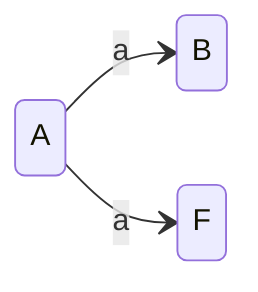

+++
title = "字符的折叠：从一维序列到抽象语法树"
sort_by = "weight"
weight = 0
+++

程序究竟是什么？

​当我们坐在屏幕前敲击键盘时，映入眼帘的是这样一行简单的表达式：

```a + b * c```

​对人类的视觉系统而言，这不过是屏幕上线性排列的字符。我们在脑海中凭借数学的优先级直觉，瞬间理解了它的多维含义。然而，计算机的物理内存条和文件系统是严格一维的，在机器的视野中，存在的只有字符 `a` 后面跟着空格，空格后面跟着 `+`。这就引出了形态学的第一个核心问题：机器是如何从一条扁平的、一维的字符线段中，构建出具有层次的计算结构的？

​程序在物理载体上表现为一维的字符序列 $s \in \Sigma^*$。然而，计算的本质是结构化的。将扁平序列还原为结构化表示的过程，绝不仅仅是工程上的字符串切分，而是根据 **乔姆斯基层级（Chomsky Hierarchy）** 对形式语言表达能力的要求，逐步确立并跃迁计算模型的过程。

## 乔姆斯基层级

### 正则性与元素的离散化（3型文法）

​还原计算形态的第一步，是从连续的字符流中识别出具备独立语义的原子单位。观察如下片段：

```if (count > 10)```

​人类直觉首先将字符聚合成单词，要将 `i`, `f` 聚合成 `IF` 关键字，将 `1`, `0` 聚合成数字字面量。这些单词（关键字、标识符、字面量）的核心特征是非递归性，即一个词法元素的内部结构是纯粹线性的，绝对不包含对自身类别的嵌套引用。例如，一个数字内部不可能包含另一个 if 语句，一个变量名内部也无法递归地塞入另一个表达式。由此，其构造过程非常简单：先长一个字母，然后你可以选择停止，或者再长一个字母。

​如果用代数式表达，它只有两种形态：
- ​线性延伸（Linear Progression）：$A \to aB$
- ​终止（Termination）：$A \to a$

这也对应了**有限自动机（Finite Automata）**的运作流程：



这就是 **3 型文法（正则文法，Regular Grammar）** 或 **线性文法（Linear Grammar）**。

然而，其产生式的形式受到严格限制：任何非终结符 $A$ 只能推导出“一个终结符”或“一个终结符紧跟一个非终结符”。由此，我们从起始符号 $S$ 开始推导，生成的中间形态永远是：

$$s_1 s_2 \dots s_k B$$

其中 $s_i$ 是已经确定的字符，而 $B$ 是唯一的、位于末端的可变活性中心。这意味着，正则文法在任何时刻都只维护一个待处理的生长点，且这个生长点无法感知它左边已经生成的序列。

假设一个有限自动机只有 $p$ 个状态，如果我们要它处理一个长度超过 $p$ 的字符串（比如一串极长的括号 $[[[[....]]]]$），根据抽屉原理，它在读取过程中必然会回到某个曾经经过的状态。一旦回到旧状态，就意味着机器陷入了一个可以无限循环的“环路”，机器无法区分它经过这个状态的次数，也就无法保证左括号和右括号的数量严格相等。


若 $L$ 是一个正则语言，则存在一个正整数 $p$（称为泵长度），使得对于 $L$ 中任意长度不小于 $p$ 的字符串 $w$（即 $|w| \ge p$），都可以将 $w$ 切分为三部分 $w = xyz$，满足：
- 可循环性：$\forall k \ge 0, x y^k z \in L$
- 循环段非空：$|y| > 0$
- 循环发生在早期：$|xy| \le p$

$$
\begin{aligned} L \in \text{Regular} \implies & \exists p \ge 1, \forall w \in L, (|w| \ge p \implies \\\\
 & \exists x, y, z \in \Sigma^* \text{ s.t. } (w = xyz \land |y| > 0 \land |xy| \le p \land \forall k \ge 0, xy^k z \in L)) \end{aligned}
$$


设正则语言 $L$ 由右线性文法 $G = (V, \Sigma, R, S)$ 生成。令泵长度 $p = |V|$（即非终结符的数量）。

考虑 $L$ 中任意长度 $|w| \ge p$ 的字符串 $w = a_1 a_2 \dots a_n$。要生成该字符串，其推导序列必然经过 $n$ 步（或更多）：$$S \xrightarrow{a_1} A_1 \xrightarrow{a_2} A_2 \dots \xrightarrow{a_p} A_p \dots \to w$$

观察前 $p$ 步推导中出现的非终结符序列 $(S, A_1, A_2, \dots, A_p)$。该序列共有 $p+1$ 个项。由于非终结符集合 $V$ 的大小仅为 $p$，在前 $p+1$ 项中必然存在两个相同的非终结符:
$$0 \le i < j \le n \text{  s.t.  } A_i = A_j$$

这意味着从 $A_i$ 出发，经过一段推导 $y = a_{i+1} \dots a_j$，将再次回到 $A_i$，即：
$$A_i \xrightarrow{*} y A_i$$

无限次地套用这个推导：$$A_i \to y A_i \to yy A_i \to yyy A_i \dots$$这就意味着，如果字符串 $w$ 被切分为 $x$（$A_i$ 之前的序列）、$y$（重复段）和 $z$（$A_j$ 之后的终结序列），那么对于任何 $k \ge 0$，$x y^k z$ 都在该语言中。即：
$$\\{x y^k z \mid k \ge 0\\} \subseteq L(G)$$


现在让我们考虑描述任意长度嵌套的中括号语言$L = \\{ [^n ]^n \mid n \ge 1 \\}$ ，假设它是正则的，那么存在泵长度 $p$，使得 
$$ \forall |w|>p, w=xyz, \text{ s.t. } |xy| \le p, |y| > 0, \forall k \le 0, xy^kz \in L$$

取 $w=[^p]^p$，因为 $|xy| \le p$，而 $w$ 的前 $p$ 个字符均为 $[$ ，因此 
$$y=[^m, m>0$$
可推出 $$xy^2z=[^{p+m}]^p \in L$$
显然矛盾。

以上说明，仅凭正则文法，绝对无法处理程序的嵌套拓扑。因此，这一层级的处理（在工程上称为**词法分析 Lexical Analysis**），其极限只能是产出离散化的 **词法单元（Tokens）** 序列。代码在这里完成了结晶，但尚未获得多维空间。

### 上下文无关与拓扑的生长（2型文法）

​为了支持表达式与控制流的无限嵌套，语言必须具备递归推导的能力。这要求文法跃迁至 **2 型文法（上下文无关文法，Context-Free Grammar, CFG）**。其产生式的标准形式为：
$$A \to \gamma, \quad A \in V, \gamma \in (V \cup \Sigma)^*$$

这意味着，一个非终结符 $A$ 可以被替换为一段包含其他非终结符的序列。

为什么 2 型文法能够描述嵌套？类似于正则语言，我们可以证明对于任何长度大于某个常数 $p$ 的上下文无关语言字符串 $w$，其派生树必然存在一条极长的路径，导致某个非终结符 $A$ 在路径上重复出现：
$$S \xrightarrow{ * } uAz \xrightarrow{ * } uvAyz \xrightarrow{ * } uvxyz$$


若 $L$ 是一个上下文无关语言，则存在一个泵长度 $p$，使得对于 $L$ 中任意长度 $|w| \ge p$ 的字符串，都可以将其切分为五部分 $w = u v x y z$，满足：
- 扩张性：$|vy| > 0$（中间的重复结构至少包含一个符号）
- 局部性：$|vxy| \le p$（重复生长的核心区域是局部的）
- 同步增长：对于所有 $n \ge 0$，有 $u v^n x y^n z \in L$。

$$\begin{aligned} 
L \in \text{CFL} \implies & \exists p \ge 1, \forall w \in L, (|w| \ge p \implies \\\\
& \exists u, v, x, y, z \in \Sigma^* \text{ s.t. } (w = uvxyz \\\\
& \land |vy| > 0 \\\\
& \land |vxy| \le p \\\\
& \land \forall n \ge 0, uv^nxy^nz \in L))
\end{aligned}$$


这意味着文法中蕴含着一种递归的“向心生长”模式：
$$A \xrightarrow{ * } vAy$$

即每当我们通过这个规则生成左侧的碎片 $v$ 时，必须同步地在右侧生成对应的碎片 $y$，以包裹住核心的 $x$。根据泵引理，对于任何 $n \ge 0$，$uv^nxy^nz$ 依然属于该语言。这种 $v$ 与 $y$ “同增同减” 的约束，刻画了计算形态中最基础的对称美学——括号的匹配、作用域的开启与闭合、函数的调用与返回，等等。

由于 CFG 允许嵌套（即在 $A$ 还没闭合时，又开启了一个新的 $B \xrightarrow{ * } sBt$），机器面对的是一个“先进入的层级后闭合”的逻辑。这种后进先出（LIFO）的特性在物理实现上必然指向一种特定的数据结构：栈（Stack）：
- 入栈（Push）： 每当解析器识别出一个向心生长的左翼 $v$（例如`[`或 `begin`），它必须将当前的上下文状态压入栈中
- 出栈（Pop）： 每当识别出对应的右翼 $y$（例如 `]`或 `end`），它从栈顶取出最近的一个状态进行比对

这就形成了**下推自动机（Pushdown Automaton, PDA）**。

### 上下文相关与逻辑约束（1型文法）

当程序跨越了上下文无关的嵌套拓扑后，计算形态学便遭遇了语言学中最棘手的壁垒：符号的指代与环境约束。

在真实的编程语言中，符号的存在并不是孤立的。一个变量的“使用”必须与其前置的“声明”遥相呼应；一个函数的“调用”必须与其定义的“签名”严丝合缝。这种要求语言结构的某一部分必须与另一部分保持绝对一致的特性，在形式语言的理论极限上（在编译器设计中通常不会这么看），标志着文法必须跃迁至 **1 型文法（上下文相关文法，Context-Sensitive Grammar, CSG）**。其产生式的标准形式为：
$$\alpha A \beta \to \alpha \gamma \beta$$

这意味着，非终结符 $A$ 只能在左侧有 $\alpha$ 且右侧有 $\beta$ 的特定上下文环境中，才能被替换（或折叠）为 $\gamma$。与之对应的计算模型是**线性有界自动机（Linear Bounded Automaton, LBA）**——一种内存受限于输入序列长度的图灵机。

为什么 2 型的下推自动机绝对无法处理这种约束？我们可以通过 **拷贝语言（Copy Language）** 来进行推导：

以自定义定界符的语法为例，其要求起始括号 `(` 前面的标记（`my_tag`），必须与闭合括号 `)` 后面的标记绝对精确地复制、一致：
```c++
R"my_tag( 这是一个包含 "引号" 的字符串 )my_tag"
```
这种“开启标记必须与闭合标记发生平移复制”的规则，在数学上可以抽象为如下语言：
$$L = \\{ wcw \mid w \in \\{a, b\\}^* \\}$$

其中，第一个 $w$ 代表起始标记，第二个 $w$ 代表闭合标记，$c$ 是包含在括号内的任意文本负载。假设该语言是上下文无关的（2型），那么它必须满足 CFG 的泵引理。存在一个泵长度 $p$，使得对于任何长度足够长的字符串 $s \in L$，都可以划分为 $s = uvxyz$，且满足 $|vxy| \le p$ 以及 $|vy| > 0$，使得对于任意 $k \ge 0$，$uv^kxy^kz \in L$。

我们取字符串 $s = a^p b^p c a^p b^p$ 作为定界符。由于 $|vxy| \le p$，子串 $vxy$ 的长度受到了严格的局部性限制。它在原字符串中可能出现的位置只有三种情况：
- 完全位于中心 $c$ 的左侧（即只修改了起始标记 $w$ 的某一部分）
- 完全位于中心 $c$ 的右侧（即只修改了闭合标记 $w$ 的某一部分）
- 跨越了中心 $c$。即使跨越了 $c$，由于 $|vxy| \le p$，它最多只能同时包含左侧的 $b^p$ 和右侧的 $a^p$

无论哪种情况，当我们进行“泵入”（例如取 $k=2$）时，由于 $v$ 和 $y$ 无法同时跨越并对称地修改首尾的两段 $a^p$ 或 $b^p$，左侧的字符串与右侧的字符串必然会失去相等性。由此得出 $uv^2xy^2z \notin L$，产生矛盾。

事实上，CFG 的栈（LIFO）结构只能处理“镜像对称”（如 $ww^R$，即括号匹配），栈的特性是“先进后出”，它天生适合把吞进去的字符倒吐出来，因此完美契合左右括号的嵌套匹配 `({[]})`。但是，栈绝对无法处理“平移复制”（如 $ww$），因为如果要按原本的顺序进行匹配，PDA 必须强行把压在栈底的元素先抽出来，这直接违背了栈作为计算模型的物理性质。

为了处理这种平移复制，计算模型必须跃迁。解析器被迫分配一块独立的内存或者动态修改词法分析器的状态（c++ 往往这样做），将遇到过的 `my_tag` 强行记忆下来，并在几千行字符之后将其取出比对。这一刻，解析器打破了上下文无关的枷锁，其行为实质上已经退化成了上下文相关文法所对应的线性有界自动机。

然而，面对这种理论上的必然跃迁，现代的工程实践中做出了一个极其深刻的区分。我们通常不会说“这门语言的文法是上下文相关的”。因为一旦让解析器去处理 1 型文法，解析的时间复杂度将变得难以接受。

相反，编译器工程确立了 **语法（Syntax）** 与 **静态语义（Static Semantics）** 的彻底分隔：
- 语法是上下文无关的：解析器不管变量是否声明，只要它符合形态拓扑，就用 2 型文法强行建起一棵粗糙的语法树。
- 语义施加上下文约束：变量的一致性不再是“文法生成”的问题，而是交由类型系统或属性文法，在已经建好的语法树上进行后续的遍历与查表。

当然，这种纯粹的割裂有时也会遭到工程现实的破坏。让我们以 C++ 为例：
```c++
T * p;
```
对于 2 型文法而言，这既可以是一棵以 `*` 为根节点的乘法表达式树（`T` 乘以 `p`），也可以是一棵变量声明树（声明一个类型为 `T` 的指针 `p`）。如果不去查询当前作用域的符号表，机器根本无法决定如何折叠这棵树。当解析器被迫停下来，去查询 T 在上文中是否被定义为一个类型时，语法的纯粹性就被打破了。我们通常称 C++ 的文法“不是纯粹的上下文无关文法”，它往往依赖于一种被称为 `Lexer Hack` 的工程手段来处理当上下文约束“泄漏”到语法解析阶段时的尴尬矛盾。由于本书重点并非编译原理，在此也不过多赘述。

### 无限制文法与图灵完备（0型文法）

如果我们允许文法在上下文中进行任意的推导与计算，计算形态的折叠最终将抵达乔姆斯基层级的顶端：**0 型文法（无限制文法，Unrestricted Grammar）**。
其产生式没有任何限制：
$$\alpha \to \beta, \quad \alpha \in (V \cup \Sigma)^+, \beta \in (V \cup \Sigma)^*$$

只要左侧包含至少一个非终结符，规则就可以任意改写。0 型文法在表达能力上等价于图灵机。这意味着，程序的最终形态可能依赖于一个任意复杂度的计算结果。事实上，几乎没有语言真正采用 0 型文法（原因后面会谈），但是，有相当一部分语言的编译期计算系统具备了图灵完备的能力。最典型的例子是 C++ 的模板元编程（Template Metaprogramming）或 Agda 中的依赖类型（Dependent Types）。我们同样以 C++ 为例：
```c++
template<int N>
struct Fib { static const int value = Fib<N-1>::value + Fib<N-2>::value; };
template<>
struct Fib<0> { static const int value = 0; };
template<>
struct Fib<1> { static const int value = 1; };

int main() {
    int arr[Fib<100>::value];
}
```

在这段代码中，`arr` 的类型和内存布局（即它在 AST 中的具体形态），完全取决于 `Fib<100>::value` 的计算结果。为了完成类型检查和实例化，解析器或类型检查器必须在编译期执行这段递归计算，从而能够在编译期报出 `Overflow in expression` 的错误。

根据图灵机的停机问题，我们无法编写一个通用算法来判定任意图灵机是否会停机。因此，如果语言的解析或类型验证过程是图灵完备的，那么编译过程本身就成为了一个不可判定的问题，即编译器可能会在试图折叠这棵代码树的过程中陷入死循环，永远无法产出最终的形态。

另一方面，根据莱斯定理，如果允许程序的形态在编译期进行图灵完备的演化，那么将无法编写一个通用的编译器来判定该程序是否具备某种语义特征，任何关于程序“最终会变成什么样”的静态预判都将失效。


对于任意递归可枚举语言（即 0 型语言）的集合，其任何非平凡的语义性质都是不可判定的。

所谓**非平凡（Non-trivial）性质**，是指**对、且仅对**部分递归可枚举语言成立的性质。


由于本书重点不是计算理论或程序静态语义分析，这里不做证明。

## ​判定性的妥协与关注点分离

由此，现代编程语言的设计者陷入了一个矛盾：

- 为了描述变量声明、类型检查和元编程，语言的整体验证逻辑及编译期的计算系统必须具备事实上 1 型甚至 0 型的表达能力。
- 为了保证编译器能在合理的时间内运行结束，且不陷入死循环，我们必须将解析过程限制在具备高效可判定性的 2 型层级。

这种矛盾导致了编程语言在构建过程中一次伟大的分离——我们将程序的“形态生成”与“语义约束”彻底解耦。

既然 1 型和 0 型层级会导致解析过程的不可判定或极度低效，现代编译理论做出了一项极其务实的工程决断：在语法解析阶段，强行对语言进行降维，用 CFG 去过度近似它。解析器被设计为一种宽容的几何折叠机，它仅凭局部的、上下文无关的规则，先在内存中强行撑起一座粗糙的结构骨架。至于那些必须依赖环境才能验证的约束（变量是否一致、类型是否匹配、模板如何展开），则被全盘推迟到后续的 **静态语义分析（Static Semantic Analysis）** 阶段去处理。

这种分离，不仅拯救了编译器的性能（使得解析过程保持在 $O(n)$ 或 $O(n^3)$ 的多项式时间内），更在理论上确立了编程语言的形态学分层：语法（Syntax）负责勾勒空间的几何拓扑，而语义（Semantics）与类型系统（Type System）则负责在这座拓扑结构中执行逻辑的法则。

## 具体语法树

当 2 型的下推自动机按照 CFG 的规则，一步步将 Token 序列归约或推导完毕时，其所经历的推导路径，可以形式化地表示为一棵派生树。在语言学和编译工程中，这被称为**具体语法树（Concrete Syntax Tree, CST）**。

如果设 CFG 为 $G = (V, \Sigma, R, S)$，其中 $V$ 是非终结符集合，$\Sigma$ 是终结符（Token）集合，$R$ 是推导规则。那么 CST 的每一个内部节点都严格对应着 $V$ 中的一个非终结符，每一次父节点到子节点的分支，都绝对忠实地记录了 $R$ 中某一条规则 $A \to \gamma$ 的物理应用。

​如果你去检视这棵树，会发现它极其臃肿。为了处理算符优先级和结合性，文法设计者不得不硬塞进去大量的中间非终结符（如 `Term`, `Factor`, `Primary`）。以 `1 + 2 * 3` 为例，为了让乘法优先于加法，数字 `3` 可能需要经历 $Expr \to Term \to Factor \to Number$ 的长途跋涉，才能在树的最底端找到自己的位置。此外，树的叶子节点中还充斥着大量的括号 `(`、`)`，分号 `;` 以及逗号 `,`。

在此视角下，具体语法树是尴尬的产物。它是多维计算逻辑与一维文本载体相互妥协的物理遗迹。那些多余的括号和中间节点，仅仅是下推自动机在对抗一维序列歧义时使用的脚手架。它们服务于“解析”这一物理过程，但对程序本质的代数语义毫无贡献。

计算的真理不在于包装，而在于结构本身。由此，我们必须进行一次剥离。

## 抽象语法树

剥离掉所有仅仅为了消除语法歧义而存在的非终结符，剔除掉所有作为边界界定符的标点与括号。当繁华散尽，留在内存中的，便是**抽象语法树（Abstract Syntax Tree, AST）**。

在许多工程视角的教材中，AST 仅仅被描述为“去掉了括号的 CST”。但从更严谨的视角看，AST 的确立是编程语言形态的一次关键奠基。AST 不再是物理解析的附属品，而是一个自我自洽的、严格的**多重代数系统（Many-sorted Algebraic System）**。
构成这个纯粹几何形态的，是三个核心基石：
- **类别（Sorts）**：AST 的节点并非同质化的数据块，它们被严格划分为不同的语法范畴集合 $S$。例如，在典型的命令式语言中，“求值的产物（Expr）”与“状态的跃迁（Stmt）”分属截然不同的形态类别。类别是形态组合的物理边界——你不能在一个期望表达式的插槽里，强行嵌合一个声明结构的语句。
- **算符（Operators）**与**推导法则（Inference Rules）**：形态的生长逻辑AST 的内部结构由算符生成。在编程语言理论中，我们通过推导法则来刻画形态的生成法则。每一个复合形态的诞生，都是一次严密的逻辑演绎。以控制流中的条件分支算符 `branch` 为例，它的生成法则可以被精确地书写为：
$$ \frac{e_1 : \text{Expr} \quad e_2 : \text{Stmt} \quad e_3 : \text{Stmt}}{\text{branch}(e_1, e_2, e_3) : \text{Stmt}}$$
横线上方是形态生长的前提，横线下方是组合形成的结论。它表明：当且仅当我们拥有一个表达式 $e_1$，以及两个语句 $e_2$ 和 $e_3$ 时，这三者才能越过这道横线，形成一个全新的、合法的语句形态 $\text{branch}(e_1, e_2, e_3)$。在这里，表层语法中繁杂的 `if`、`else` 和大括号都消失了，取而代之的是纯粹的逻辑演绎。
- **变量（Variables）**：在代数形态中，变量 $x \in X_s$（类别 $s$ 的变量）不再是一个存储地址的别名，而是计算结构中的未知占位符。在 AST 的层面上，变量是计算结构中的拓扑空隙。它代表着一种预期：这个空间位置，未来可以且必须被另一个具有相同类别 $s$ 的 AST 结构所嫁接。变量的存在，使得程序从封闭的定局，变成了可无限演化的开放形态。更本质地，变量的名字（如 $x, y, z$）仅仅是临时的语义标签，而不具备本体论上的地位。如果我们将一棵树中所有的 $x$ 统一替换为 $y$，只要它们与算符之间的连接拓扑保持一致，那么在计算的宇宙中，这两棵树便是完全等价的。这种“形态的一致性凌驾于标签之别”的特性，被称为 **$\alpha$-等价**。我们将在后续更为详细地讨论它。

正是由于 AST 具备这种严密的代数构造，我们往往将 AST 视为一种 **初始代数（Initial Algebra）** 。

所谓“初始”，意味着它是结构最纯粹、未受任何特定语义“污染”的源头形态。在初始代数中，`1 + 2` 就仅仅是 `plus(1, 2)` 这棵树本身，它还没有被求值为 `3`。任何后续的计算（如解释执行、类型推导、编译为机器码），在数学本质上，都是从这棵“初始代数树”向其他代数系统（如目标机器的语义空间）的一个同态映射。这为我们后续卷帙中即将探讨的代数数据类型埋下了伏笔。

有了这座纯粹的初始代数骨架，我们才获得了对无限的程序空间进行有限推理的终极武器—— **结构归纳法（Structural Induction）** 。因为所有的形态都是由基础变量和常量通过有限的算符规则递归构建而成的，所以任何关于计算形态的数学性质，都可以沿着这棵代数树的生成法则获得归纳证明。而在某些语言中，这种结构递归甚至成为了程序本身的基本计算方式。

---

至此，字符的折叠宣告完成。

程序彻底摆脱了文本的一维外壳与解析器的物理妥协，结晶为计算空间中坚实的代数构件。我们终于为无形的计算，铸造了一副可供严密审视的几何骨架。接下来，我们将在这副纯粹的骨架之上，探讨“名字”的实质，以及作用域的阴影是如何在树的枝桠间蔓延的。